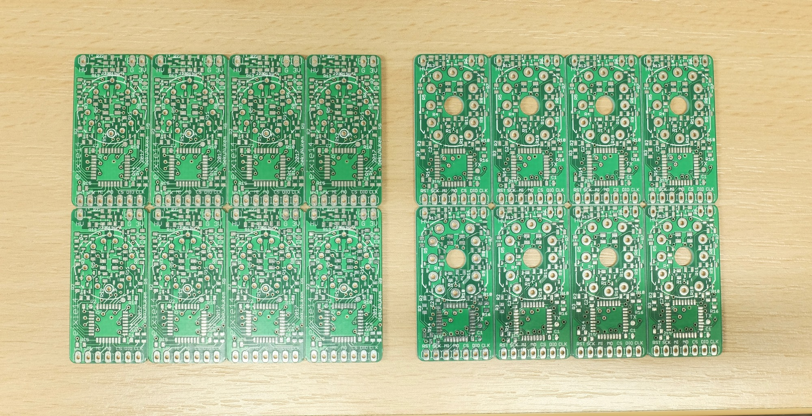

# exixe: Low-cost miniature Nixie tube driver modules

exixe is a low-cost miniature driver module for IN-12 and IN-14 Nixie tubes.

Instead of using obscure out-of-production driver chips, it uses a STM32 to handle display and dimming of all digits with hardware PWM. The module is controlled via standard SPI protocol, and has onboard RGB LED backlight.

exixe is cheap, small and modular for easy integration. It is compatible with Arduino, Raspberry Pi, ESP8266, and virtually all embedded dev boards today.

Since each tube has its own driver, there is no need for multiplexing. Thus reducing the power consumption, simplifying the circuit design, increases perceived brightness, and prolongs the tube life.

## Video

Here's a short video of exixe14 modules in action on the [high precision clock](https://github.com/dekuNukem/exixe_clock) shown in the above picture:

https://www.youtube.com/watch?v=r3d2alzgjKc

Questions, inquires, or want to buy some? Feel free to email me at `dekunukem gmail com`.

## Features

Compared to the traditional approach, exixe modules offers significant advantages:

#### Small and modular
* 2x4 cm (0.79x1.57 inches)
* Breadboard friendly
* Easy integration

#### Low-cost
* $3 in components
* No need for expensive obscure vintage driver chips

#### SPI interface
* High speed, up to 24MHz SCLK
* Available on virtually all embedded systems including Arduino and Raspberry Pi
* Simple 16-byte command packet

#### Advanced control
* Powered by ARM Cortex-M0 microcontroller
* Hardware PWM on all cathodes and LEDs for smooth dimming and animations

#### Tube overdrive
* Optionally allows twice the cathode current
* For poisoned cathodes in second-hand tubes

#### RGB backlight
* Because RGB

#### No multiplexing
* Brighter display
* Longer tube life
* Simpler design
* Less power consumption

## Pinout, SPI command format and technical details

Please see [technical_details.md](/technical_details.md)

## Getting started

Please see [getting_started.md](/getting_started.md)

## Buying some

I can custom make some exixe modules for you in small quantities. However, soldering them together and testing them takes a long time, so it's going to be more expensive than just the cost of materials.

I am also doing a small run in China for a few hundred boards, they should be ready by early 2018. I will update the repo with the purchase link once I receive them.

Also, I do have some extra empty PCBs in panels of 8, so if you want I can sell one to you. You still need to source the rest of the components and solder it together though.

Email me at `dekunukem gmail com` for inquires.

## Making Some yourself

Please see [making_some.md](/making_some.md)
