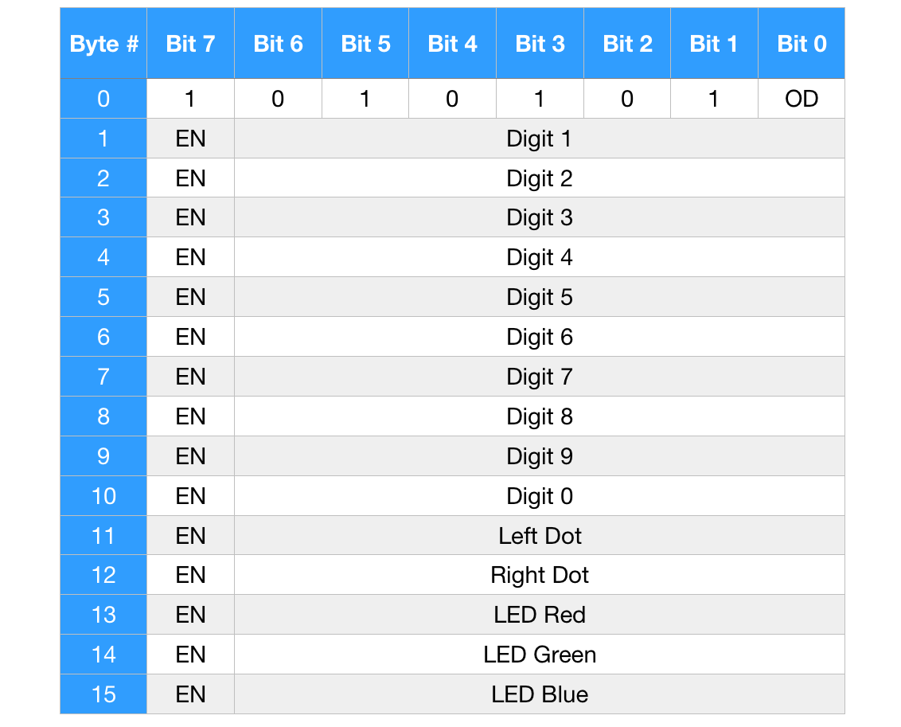
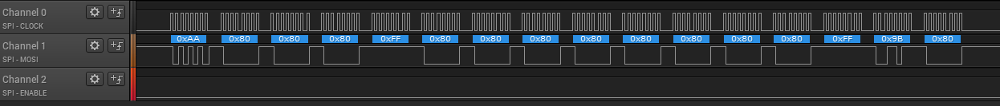
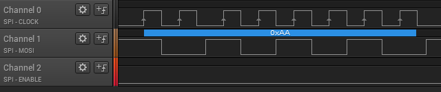
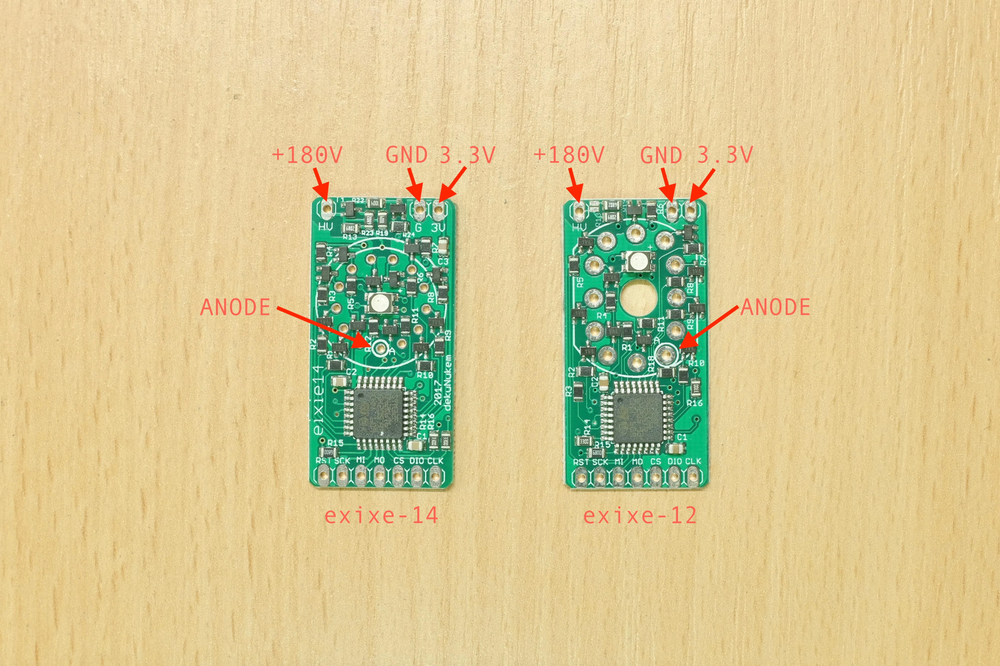
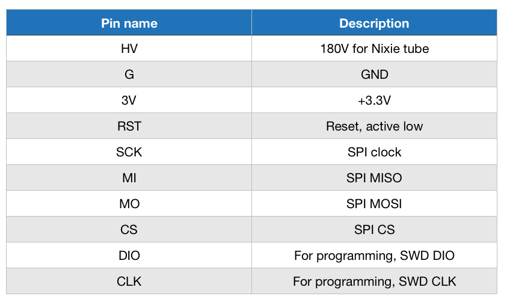

# exixe: Low-cost miniature Nixie tube driver modules

exixe is a miniature driver module for IN-12 and IN-14 Nixie tubes.

Instead of using obscure out-of-production driver chips, it uses a STM32 to handle display and dimming of all digits with hardware PWM. The module is controlled via standard SPI protocol, and has onboard RGB LED for backlight effects.

exixe is cheap, small and modular for easy integration. It is compatible with Arduino, Raspberry Pi, ESP8266, and virtually all embedded dev boards today.

Since each tube has its own driver, there is no need for multiplexing. Thus reducing the power consumption, simplifying the circuit design, increases perceived brightness, and prolongs the tube life.

## Features

Compared to the traditional approach, exixe modules offers significant advantages:

#### Small and modular
* 2x4 cm (0.79x1.57 inches)
* Breadboard friendly
* Easy integration

#### Low-cost
* $3 in components
* No need for expensive obscure vintage driver chips

#### SPI interface
* High speed, up to 24MHz SCLK
* Available on virtually all embedded systems including Arduino and Raspberry Pi
* Simple 16-byte command packet

#### Advanced control
* Powered by ARM Cortex-M0 microcontroller
* Hardware PWM on all cathodes and LEDs for smooth dimming and animations

#### Tube overdrive
* Optionally allows twice the cathode current
* For poisoned cathodes in second-hand tubes

#### RGB backlight
* Because RGB

#### No multiplexing
* Brighter display
* Longer tube life
* Simpler design
* Less power consumption

## Technical details

At the heart of the module is a STM32F042K6T6 microcontroller, which is connected to the cathodes of the Nixie tube through high-voltage transistors to turn them on or off. Thanks to the abundance of timers, every single cathode gets their own hardware PWM, which is much more consistent and smooth than software toggling.

The PWM frequency is 200Hz by default, it works well and can be changed by adjusting timer predivider values.

The microcontroller acts as a SPI slave and reads 16-byte commands from the master devices. Details of which can be found on the next section.

In normal operation each cathode has a 68K current resistor, allowing 2.6mA at 180V. However, if you're using IN-14 tubes chances are they are second-hand, and most I see doesn't light up all the way on digit 2 and 3. They are slightly poisoned and needs a bit more current to light up properly. Therefore exixe-14 features an overdrive command that allows twice that current to pass through.

Please note that you still need a high-voltage power supply around 180V for Nixie tubes to start glowing. You can design one yourself for your project, or use a pre-made module that takes 5V and outputs 180V. Just search "5V nixie power" on ebay, here's [one example](https://www.ebay.com/itm/DC-5V-12V-to-170V-DC-High-Voltage-NIXIE-Power-Supply-Module-PSU-NIXIE-TUBE-ERA-/322511957768?hash=item4b1735ef08:g:ftQAAOSwYTVZmjZb).

## SPI command protocol

### SPI configurations

* MSB first
* 8 bits per transfer
* Clock is LOW when inactive (CPOL = 0)
* MOSI data valid on clock rising edge (CPHA = 0)
* Enable is active LOW
* Max clock rate 24MHz (according to datasheet, I only tested up to 8MHz)

### SPI data format

exixe expects a fixed 16-byte command, which should be sent within one CS activation (CS down, send 16 bytes, CS up):

* Byte 0 is sent first, byte 15 sent last.

* Set OD to 0 for regular current(2.6mA), 1 to enable tube overdrive (5.3mA)

* Set EN to 1 for the following value to take effect, 0 for no change.

* Brightness values are 7-bit integer from 0 to 127, 0 being off and 127 being brightest.

* SPI commands are the same for exixe-12 and exixe-14, however OD and dots are not available on exixe-12, changing them will have no effect.

### Notes

* Only one single digit should be on at any given time, apart from during transition animations.
* Dots can be turned on alongside digits.

### Sample timing capture

Setting digit 4 to fully on while other digits are off, no overdrive, orange LED color:

Detailed timing for the first byte:

## Board pinout

* Officially, exixe modules are NOT 5V compatible.
* However it shouldn't cause damage if you put a 2.2K resistor in series of the 5V signal.
* Still, the module must be powered at 3.3V.
* Insert the Nixie tube so its anode lead is in the anode hole, and TEST THE TUBE BEFORE SOLDERING it in place.
* Pinout and dimension are the same for exixe-12 and exixe-14.

## PCB components

* The NPN transistor used on every cathode is [BF820](https://www.mouser.co.uk/Search/ProductDetail.aspx?R=BF820W%2c135virtualkey66800000virtualkey771-BF820W135)
* The single PNP transistor used in overdrive circuit is [MSB92](https://www.mouser.co.uk/Search/ProductDetail.aspx?R=MSB92ASWT1Gvirtualkey58410000virtualkey863-MSB92ASWT1G)
* Microcontroller is [STM32F042K6T6](https://www.mouser.co.uk/Search/ProductDetail.aspx?R=STM32F042K6T6virtualkey51120000virtualkey511-STM32F042K6T6)
* LED is [Wurth Electronics 150141M173100](https://www.mouser.co.uk/Search/ProductDetail.aspx?R=150141M173100virtualkey51100000virtualkey710-150141M173100)

