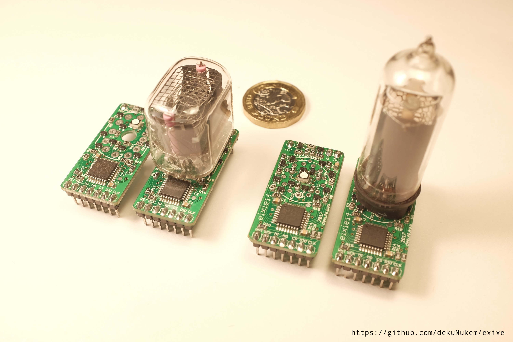
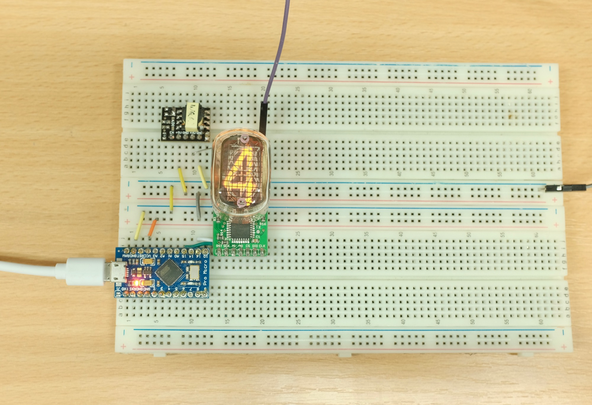
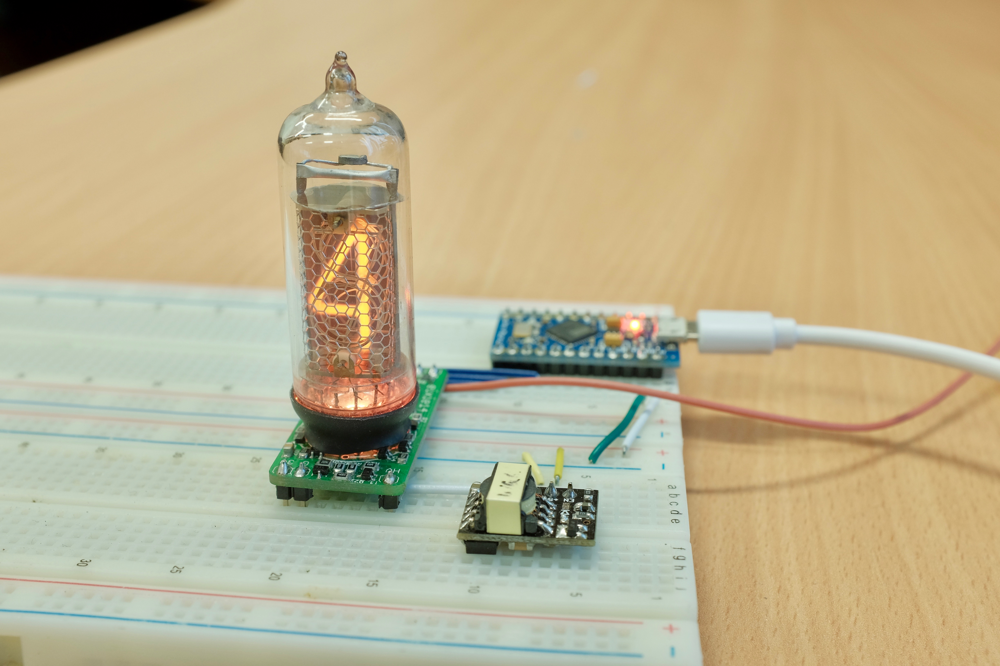
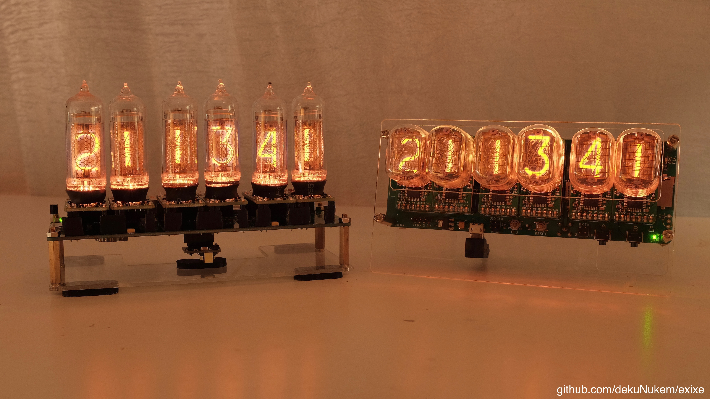

# exixe: Low-cost miniature Nixie tube driver modules

exixe is a miniature driver module for IN-12 and IN-14 Nixie tubes.

It aims to simplify Nixie tube related projects by eliminating the need for obscure vintage driver chips and multiplexing circuits. Instead, you can control every digit and the RGB backlight via SPI using only 3 wires and 1 line of code.

exixe is cheap, small and modular for easy integration. It is compatible with Arduino, Raspberry Pi, and virtually all embedded dev boards today.

## Buy exixe on Tindie!

I did a small production run of exixe modules, and now you can buy them directly on Tindie:

https://www.tindie.com/products/dekuNukem/exixe-miniture-nixie-tube-driver-modules/

## Features

Compared to the traditional approach, exixe modules offers significant advantages:

#### Small and modular
* 2x4 cm (0.79x1.57 inches)
* Breadboard friendly
* Easy integration
* Reusable

#### SPI interface
* High speed, up to 24MHz SCLK
* Simple 16-byte command packet
* Available on virtually all embedded systems including Arduino and Raspberry Pi

#### Advanced control
* RGB backlight
* 128 brightness levels
* Hardware PWM on all cathodes and LEDs for smooth dimming and animations

#### Tube overdrive
* Optionally allows twice the cathode current
* For poisoned cathodes in second-hand tubes
* [Before](resources/no_overdrive.jpg) and [after](resources/with_overdrive.jpg).

#### No multiplexing
* Brighter display
* Longer tube life
* Simpler design
* Lower power consumption

## Getting started

Please see [getting_started.md](/getting_started.md)

## Arduino Library

Please [click here](arduino_library)

## Pinout, SPI command format and technical details

Please see [technical_details.md](/technical_details.md)

## Using other tubes

You can also use exixe module with tubes other than IN-14 and IN-12, with some modification.

Please see [unsupported_tubes.md](/unsupported_tubes.md)

## Making some yourself

Please see [making_some.md](/making_some.md)

## Contact

Questions? Feel free to [open an issue](https://github.com/dekuNukem/exixe/issues). This is the preferred way since it helps other people too.

You can also email me at `dekunukem gmail com` for inquires.

## More photos

exixe-12 working with an Arduino Micro, showing a smooth crossfade animation:

exixe-14 in action on a [finished clock](https://github.com/dekuNukem/exixe_clock):

