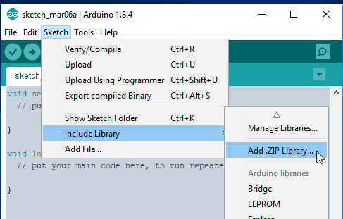

# exixe Arduino library

This is a simple Arduino library for exixe modules.

## Installation

[Click me](https://github.com/dekuNukem/exixe/blob/master/arduino_library/exixe.zip?raw=true) to download the library file.

In Arduino IDE, select `Sketch` -> `Include Library` -> `Add .ZIP Library`

Select the `exixe.zip` you just downloaded, and it should install automatically.

## Usage

A number of examples are [provided here](../arduino_examples). Take a look at the [getting started guide](../getting_started.md) to see how to use them.

#### `show_digit(uint8_t digit, uint8_t brightness, uint8_t overdrive)`

* This sets `digit` in the tube to `brightness`.

* `digit` must be between 0 to 9.

* `brightness` must be between 0 and 127. 0 being off 127 being brightest.

* `overdrive` must be 0 or 1. When set to 1 the cathode current is doubled, helping to illuminate poisoned cathodes in second-hand tubes. [Before](../resources/no_overdrive.jpg) and [after](../resources/with_overdrive.jpg). Only use on poisoned tubes, otherwise it might shorten tube life.

* Overdrive is only available on exixe-14.

* [example usage](../arduino_examples/2_loop_digit_simple)

#### `set_led(uint8_t red, uint8_t green, uint8_t blue)`

* Set the LED backlight to provided RGB value.

* Color arguments must between 0 and 127, 0 being off 127 being brightest.

* [example usage](../arduino_examples/1_LED_test)

#### `set_dots(uint8_t left_brightness, uint8_t right_brightness)`

* Sets the decimal points in the tube to the brightness arguments.

* Brightness must be between 0 and 127, 0 being off 127 being brightest.

* IN-14 has 2 DPs, IN-12B has 1 DP, and IN-12A has no DP at all.

* You can use this to turn on DP alongside digits.

#### `clear()`

* Turns off all digits, DPs, and LED backlight.

#### `crossfade_init(uint8_t digit, uint16_t duration_frames, uint8_t brightness, uint8_t overdrive)`

* This sets up a crossfade animation.

* `digit` is the digit you want to fade into. Must be between 0 and 9.

* `duration_frames` is how long the crossfade animation should last, in number of frames. 1 second is 30 frames.

* `brightness` must be between 0 and 127, 0 being off 127 being brightest.

* `overdrive` must be 0 or 1. See `show_digit()` above for details.

* [example usage](../arduino_examples/3_loop_digit_crossfade)

#### `crossfade_run()`

* Executes the crossfade animation after `crossfade_init()`.

* Call this at **least every 33ms** for a smooth animation.

* This function is **non-blocking** and will return immediately, this allows you to do some other tasks while animation is underway. Just make sure to call it frequently enough as mentioned above.

* Check its return value to see if animation is finished. Once done it should return `EXIXE_ANIMATION_FINISHED`, otherwise `EXIXE_ANIMATION_IN_PROGRESS` is returned.
