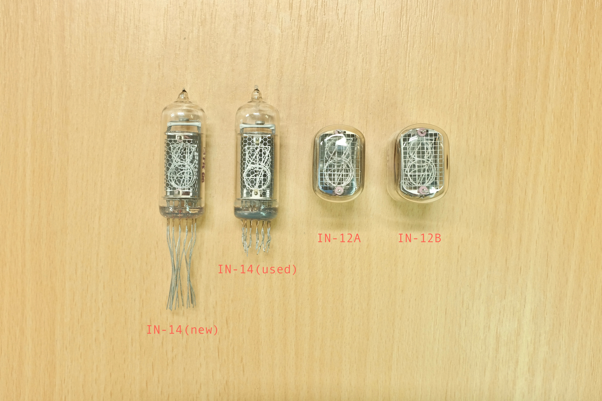

# Buying Nixie tubes

## Choices, choices...

Nixie tubes have been out of production for nearly 30 years. And thanks to the recent revival of Nixie clocks, the price of large tubes has gone astronomical. So if you want your project anywhere near reasonably priced and reliable, there are really only 2 tubes you can choose from, IN-12 or IN-14:

IN-14 is a side-view tube, while IN-12 is front-view. The digits inside are exactly the same in term of size and shape but IN-14 is more expensive thanks to its traditional tube shape. Still, those two mercury-enhanced USSR tubes have excellent reliability, often last for decades when properly driven.

exixe14 is compatible with IN-14 tubes, while exixe12 is for IN-12 tubes:

You can find them on ebay by searching [IN-12 Nixie](https://www.ebay.com/sch/i.html?_from=R40&_nkw=in-12+nixie) or [IN-14 Nixie](https://www.ebay.com/sch/i.html?_from=R40&_nkw=in-14+nixie). Most of the sellers are from Ukraine, and often you have a choice of NOS (new old stock) or used tubes.

## NOS or used?

NOS tubes are brand new and have never been used before. They are more expensive but they are the best bet when it comes to reliability and brightness.

Used tubes are desoldered from old instruments. You don't know how long they have been operating and in what condition. They have shorter pins than new tubes, often have cathode poisoning, sometimes even missing pins or pins.

For IN-14 tubes, I recommend buying new ones if you can afford it. If not, used ones work too but you do need to buy a few more than you need in case of duds.

IN-12 tubes are cheap enough so there is no reason to buy used ones at all. It has 2 variants: IN-12A and IN-12B. They are exactly the same except IN-12B has a left decimal point. Both work with exixe12 modules. 

