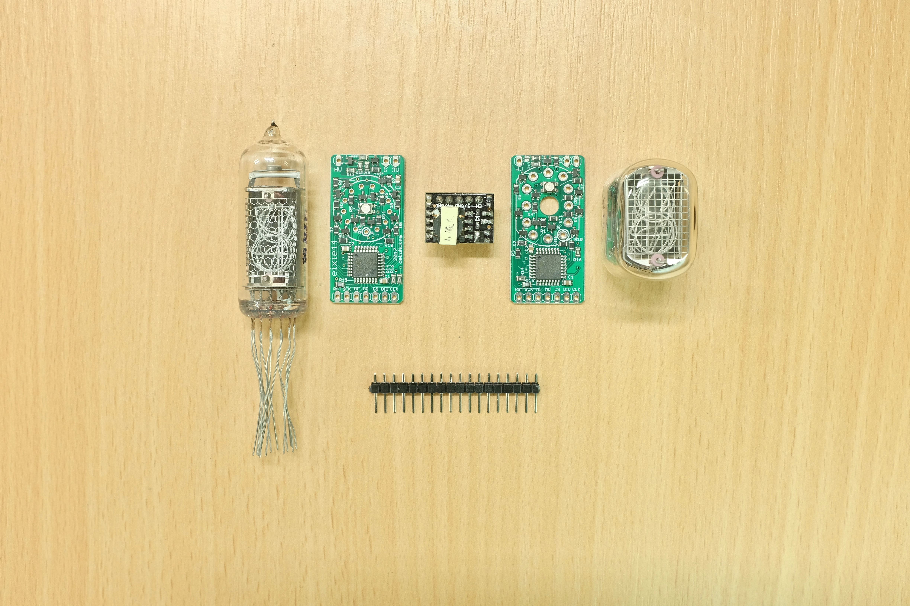
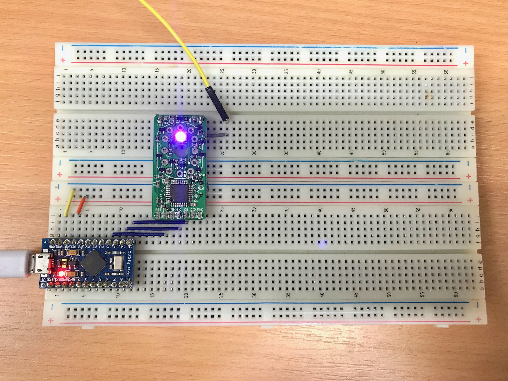
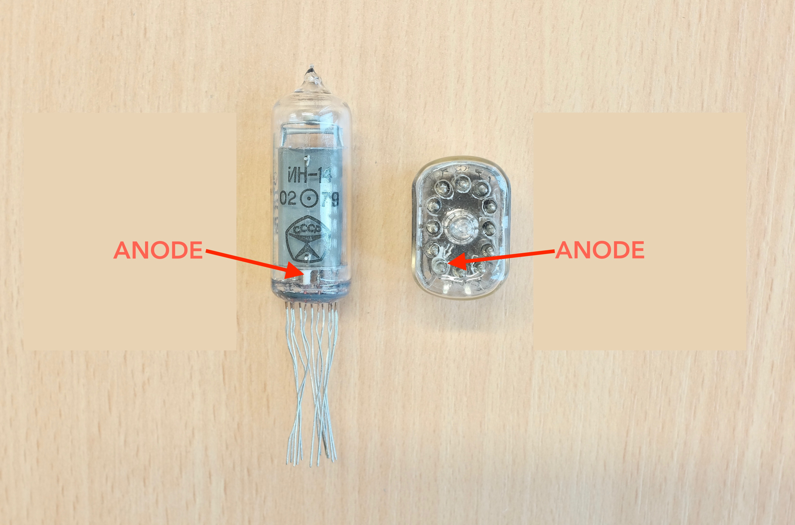
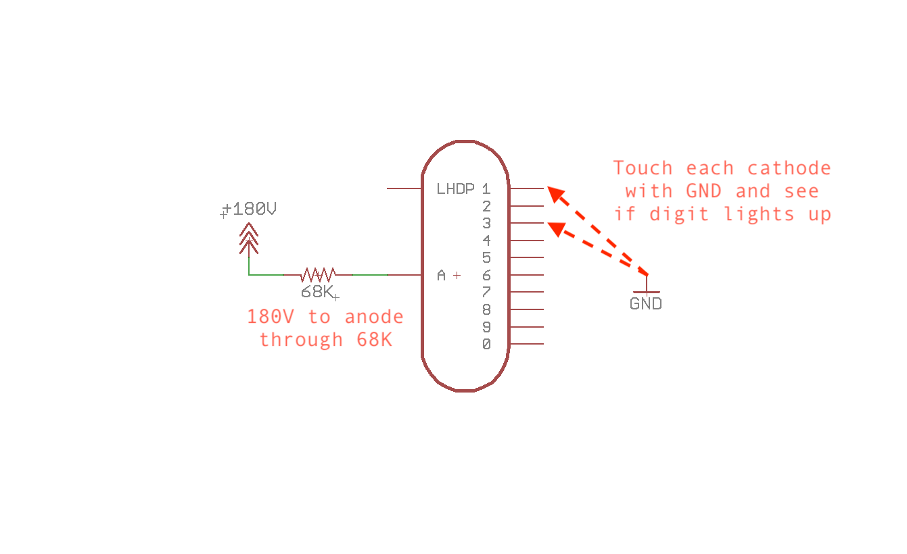
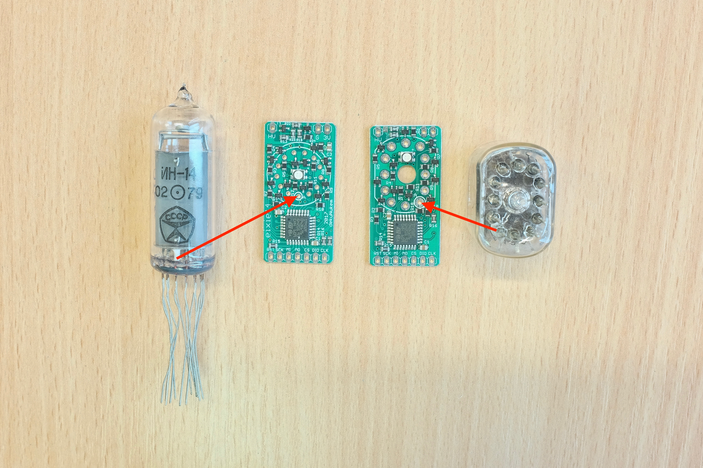
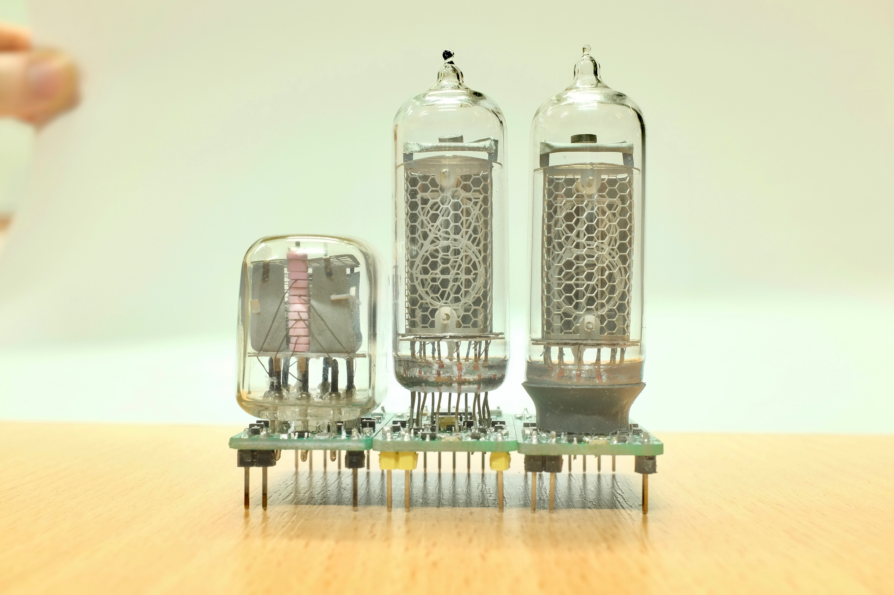
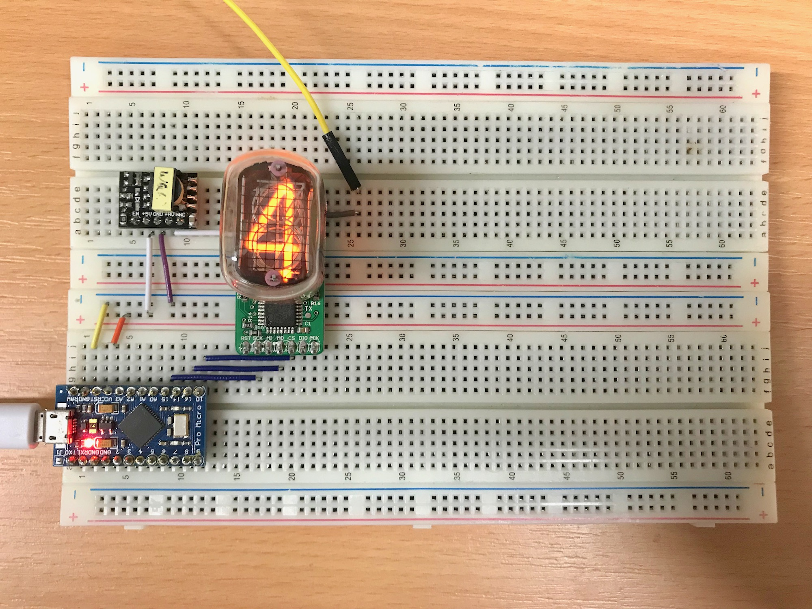

# Getting started with exixe modules

## Prerequisites

There are a couple of things you need before we get going, so let's get them out of the way first:

### Nixie Tubes

[Read this short guide to see what to buy.](buying_nixie_tubes.md)

### High Voltage Power Supply

Nixie tubes need around 180V to start glowing. That means you need a high voltage supply.

You can design one yourself, although I recommend saving the trouble and getting a premade module [like this one](https://www.ebay.com/itm/DC-5V-12V-to-180V-DC-High-Voltage-NIXIE-Power-Supply-Module-PSU-NIXIE-TUBE-ERA-/322511957768?hash=item4b1735ef08:g:ftQAAOSwYTVZmjZb). They are tiny, inexpensive, efficient, and run on 5V. Just search [5V Nixie power supply](https://www.ebay.com/sch/i.html?_from=R40&_nkw=5V+Nixie+power+supply) on ebay or google. 

In the end, you should have the tube, corresponding exixe board, headers, and the high voltage supply:

## Testing the bare module

Let's make sure the board works before hooking up high voltage and installing the tubes.

Solder on the headers, then take a look at the pinout in [technical_details.md](/technical_details.md).

First we hook up the power pins. Connect the GND to GND, and 3.3V power to 3V3. 

Next are the SPI lines. Connect MO to MOSI line, SCK to SCK line, and CS to CS line. For Arduino UNO, MOSI is pin 11, SCK is pin 13, CS is pin 10. Consult the datasheet if you're using other boards.

Then try the [LED test](/arduino_examples/0_LED_test). Compile and upload the sketch in Arduino IDE. The LED on the exixe module should turn purple. You can play around with the RGB values in the sketch to change it to other colors.

If the board is not responding, take a look at the SPI commands in [technical_details.md](/technical_details.md) to make sure the SPI is configured properly, and the commands are valid. Also make sure the RST pin is HIGH, and CS pin is asserted properly. Use a logic analyzer to see what's going on if you have one.

### Testing tubes

I recommend testing your tubes first to make sure all digits light up. You can probably get away with not doing this if you're using NOS tubes, but for used ones this is essential.

Connect +5V to 5V input of the high voltage module, and GND to GND. You should get around 180V at the HV output pin. Be very careful not to touch that. It might not kill you but you'll definitely feel a shock.

Next locate the anode on you tube:

On IN-14 the anode pin is on the very back of the tube and is white inside the glass. On IN-12 an arrow on the glass points to the anode pin, which is rather convenient.

To test the tube, connect the anode to 180V **THROUGH A 68K RESISTOR**, then touch each cathode with GND and see if the corresponding digit lights up:

Be very careful not to touch exposed metal pins, a pair of glove might help if you want to be sure.

## Solder it on

After confirming the tube is good, you can insert it to the module. Match anode pin to the anode hole, then line up everything else:

It's a bit tricky on the IN-14 since the pins are not rigid. Just be patient and eventually it will all go in. Again, make sure the anode and every other pin is lined up correctly, then solder the tube in place.

Try keep the tube straight. For IN-14 leave around 5mm of pins between the PCB and the glass as demonstrated in the middle tube:

It's also a good idea to wrap the bottom of IN-14 tubes with heat-shrink tubing or electric tape like the one on the right, to prevent backlight leaking.

## Try some examples!

Once that's done, connect 180V to the HV pin of exixe module, make sure your Arduino, high voltage supply, and exixe module all share the same GND. Then try [show_digit4](/arduino_examples/1_show_digit4) and [show_all_digits](/arduino_examples/2_show_all_digits).

The first one just shows the digit 4:

And the second one loops through all the digits from 0 to 9:

That's pretty much it! You can let your imagination run free now. You can probably adopt the functions in [show_all_digits](/arduino_examples/2_show_all_digits) for more complex display routines, or write some fancy crossfade transition animations like [here](https://www.youtube.com/watch?v=r3d2alzgjKc). And if you're not using Arduino, the code is simple enough to adept to other embedded systems.