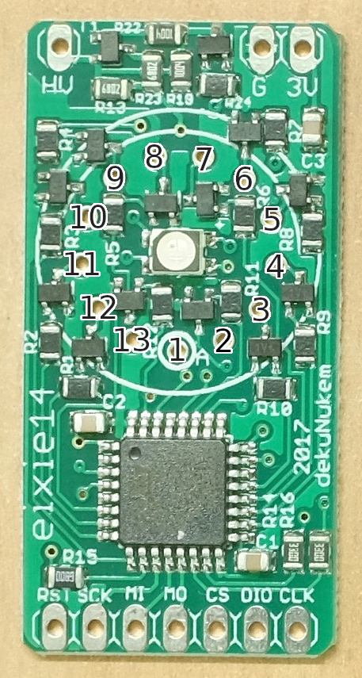

# IN-19(A,B,V) pin mapping

Exixe-14 modules are designed for IN-14 tubes, which have 13 pins. IN-19(A, B or V) tubes have 14 pins, but some are without function. The anode on IN-19 tubes (pin 8) is the one on the back and white inside the glass. Don't confuse it with the pin on the very front of the tube, which also has a white marking, but is unused (and sometimes cut off). The following table shows which pin to solder through which hole on the exixe module. Empty rows indicate that you should skip a hole and a pin. Also see the picture indicating which hole connects to which IN-14 pin. To show a IN-19 symbol using the arduino library, call `exixe::show_digit()` with the corresponding IN-14 digit, for example 3 to show a µ (IN-19A), Ω (IN-19B) or + (IN-19V).

| IN-14 pin | IN-14 symbol | IN-19 pin | IN-19A symbol | IN-19B symbol | IN-19V symbol |
|----------:|-------------:|----------:|--------------:|--------------:|--------------:|
|         1 | (anode)      | 8         | (anode)       | (anode)       | (anode)       |
|         2 | left dot     |           |               |               |               |
|         3 | digit 1      | 10        | K             | T             | -             |
|         4 | digit 2      | 11        | n             | A             | >             |
|         5 | digit 3      | 12        | µ             | Ω             | +             |
|         6 | digit 4      |           |               |               |               |
|         7 | digit 5      | 14        | °C            | Hz            | dB            |
|         8 | digit 6      |           |               |               |               |
|         9 | digit 7      | 2         | %             | S             | Π             |
|        10 | digit 8      | 4         | M             | F             | A/B           |
|        11 | digit 9      | 5         | P             | H             | ~             |
|        12 | digit 0      | 6         | m             | V             | <             |
|        13 | right dot    |           |               |               |               |

