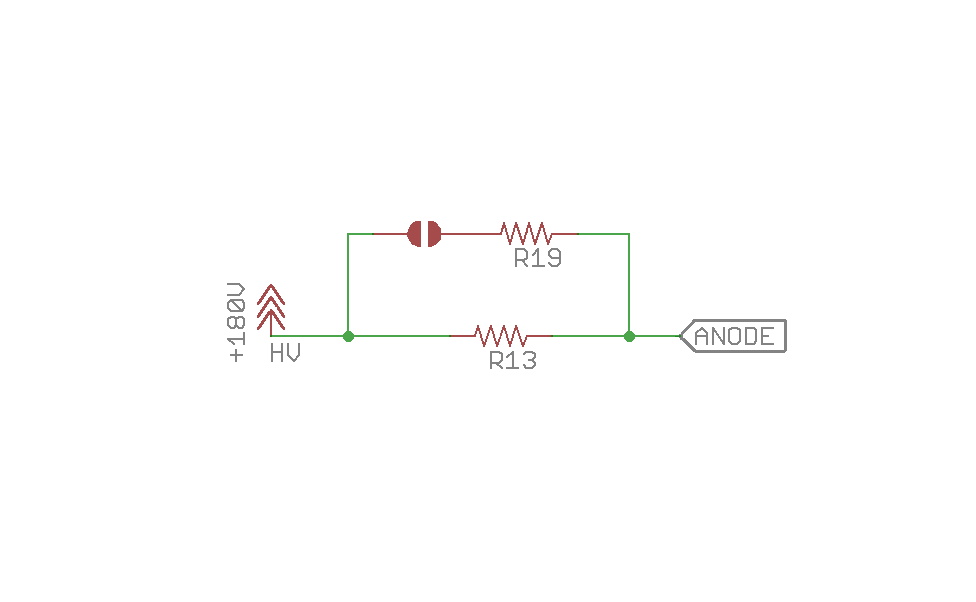
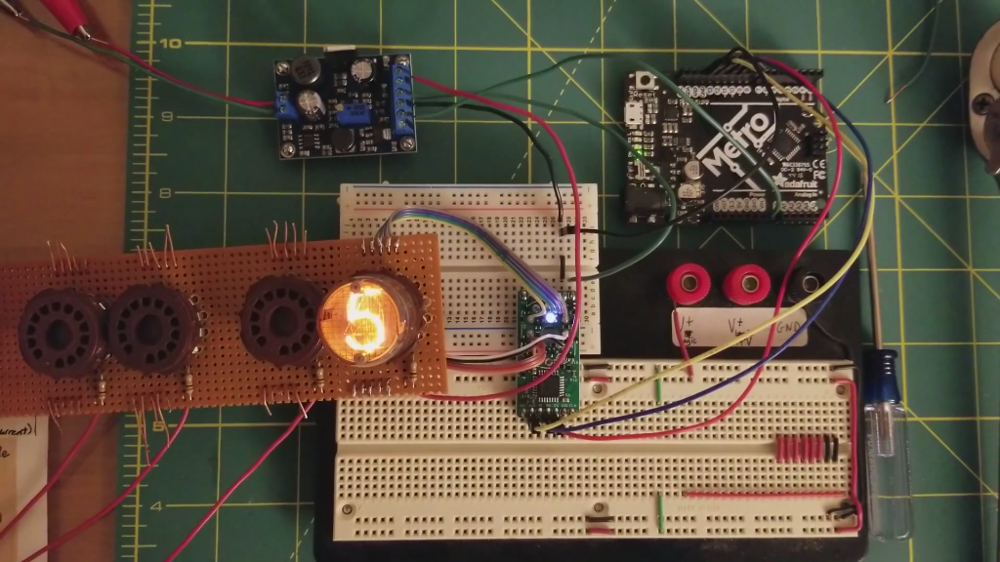

# Using other tubes with exixe modules

A number of people have been asking if they can use Nixie tubes other than IN-14 and IN-12 with exixe modules. The answer is, in most cases, yes. And here is a short guide on how to get started.

Note that I make no guarantee that it is going to work with an unsupported tube, or it won't damage the tube or itself.

Anyway, there are some subjects to consider:

## Which module?

I recommend using exixe-12 with unsupported tubes. It is cheaper and have larger holes that's easier to work with.

Get 1 or 2 at first to see if it works with your tube. [Click me to buy some](https://www.tindie.com/products/dekuNukem/exixe-miniture-nixie-tube-driver-modules/).

## Pin connections

Most likely the new tube will have a different pinout, and you won't be able to plug it in the module itself. As a result you need to use some extension wires to solder the correct pin into the correct hole. Consult this photo:

Connect the digit cathode pin to the corresponding hole, and anode pin to the anode hole.

## Cathode Current

The exixe modules limits cathode current to **`2.5mA`** by using an **`68K`** resistor before the anode.

If this works with your tube, you don't have to do anything.

If not, you will need to adjust the current limiting resistor. There are two ways of doing this.

### External resistor

This is the easiest way. Simply ignore the HV pin on the module and connect the +170V directly to your tube's anode **through a resistor of appropriate value**, then connect all the cathodes to the module as usual.

The external resistor will also be able to handle more power, so **use this method if the cathode current is more than 4mA**.

### Adjusting SMD resistor

You can also change the on-board resistor to one with the appropriate value. Here is the related circuit diagram:

As you can see, on the exixe12, the HV goes though R13 to the anode. Therefore you can change that 0805 resistor to the value you desire.

Conversely, you can also bridge the solder jumper and bring R19 into action. If you do, the two resistors will be in parallel but each will use less power, thus preventing them from overheating.

You can find the location of R13 and R19 on the photo in the `Pin connections` section above.

## Examples

An user have successfully adopted exixe-12 to work with Burroughs 5031/80376844A tubes. He used an external 10K resistor, and here is a video of it in action:

https://www.youtube.com/watch?v=TBaXTYCC1QY

## Questions?

That's pretty much it! As usual, feel free to [open an issue](https://github.com/dekuNukem/exixe/issues) if you have any questions. This is the preferred way since it helps other people too.

You can also email me at `dekunukem gmail com` for inquires.
